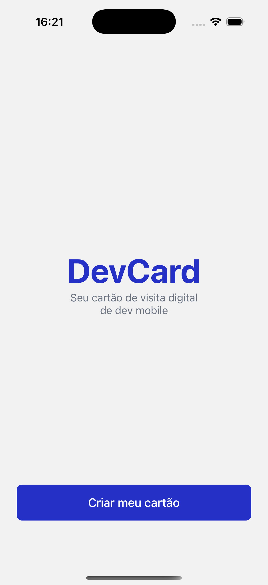
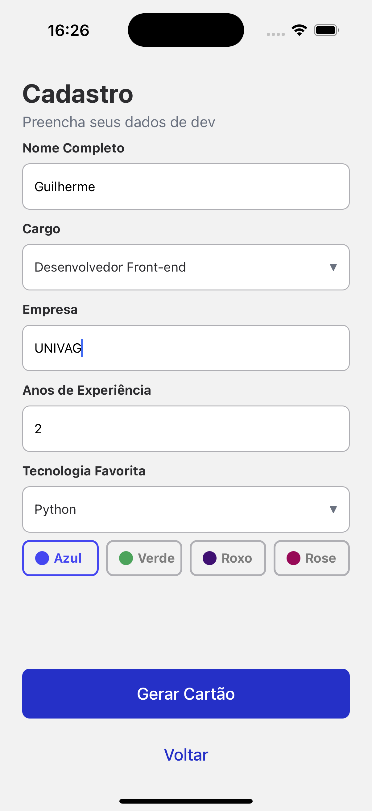
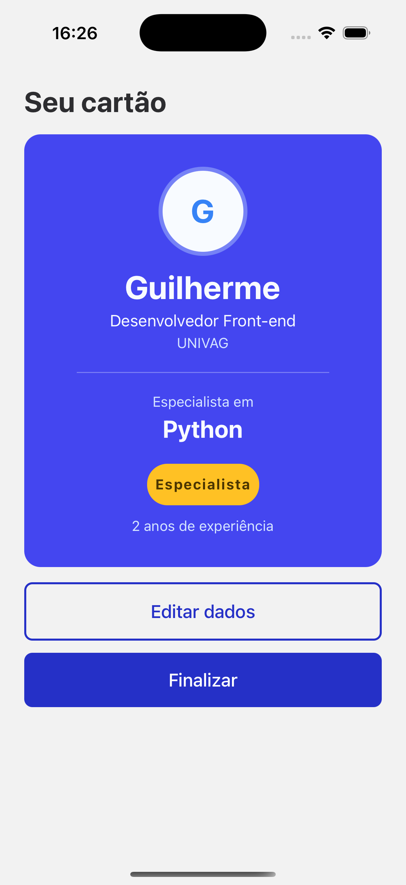
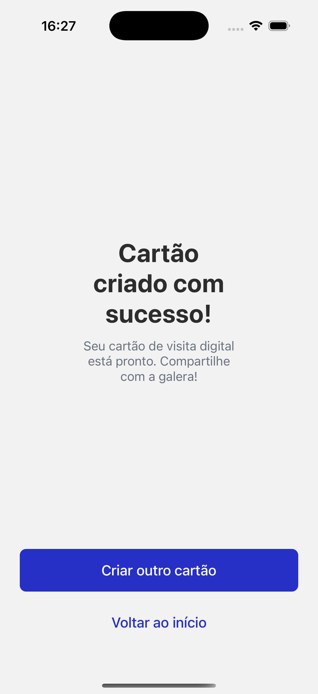

# 2º Instrumento Avaliativo - Aplicação Móveis
- Professor Brendo Vale
- Aluno: Guilherme Nistal
- Turma: ENS EAD 2026/1

---

## App DevCard

Criação de um App, chamado **DevCard**, onde seria um cartão de visita digital mobile, para desenvolvedores ou profissionais da TI. A produção deste App foi a partir da IA2, do 2º bimestre, da matéria de Aplicações Móveis, com o professor Brendo Vale.

O **DevCard** é um cartão de visita digital para desenvolvedores mobile.

### Funcionalidades

- Tela de boas-vindas
- Formulário de cadastro com validação 
- Preview do cartão com cor personalizada e badge de nível
- Tela de sucesso com confirmação

### Tecnologias utilizadas

- React Native
- Expo
- Expo Router
- TypeScript
- Flexbox

## Capturas de tela

### 1. Tela Inicial

### 2. Formulário

### 3. Preview do Cartão

### 4. Sucesso

